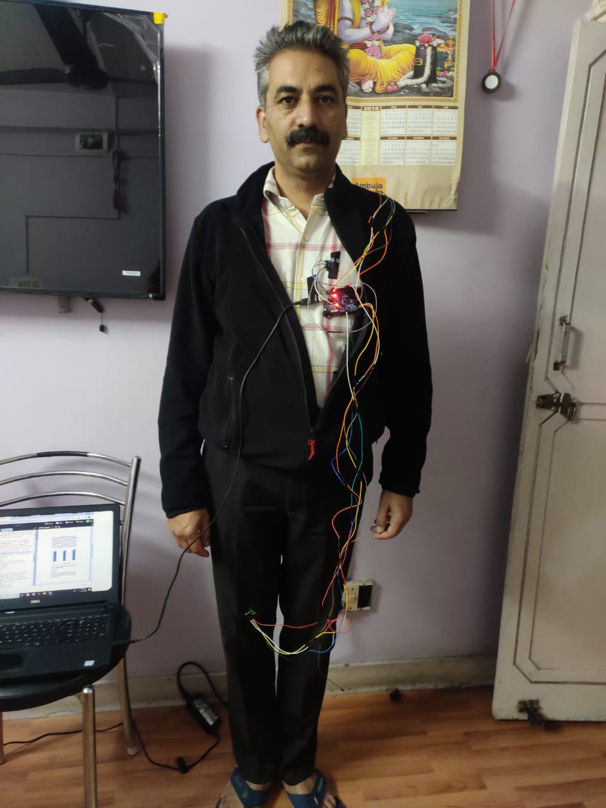
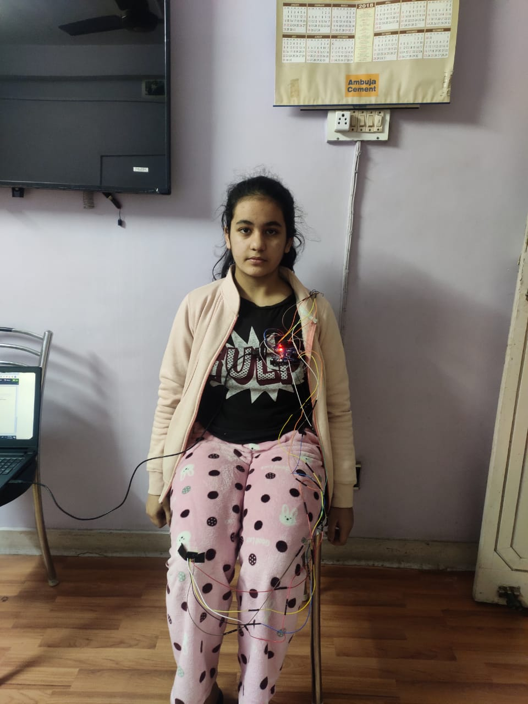
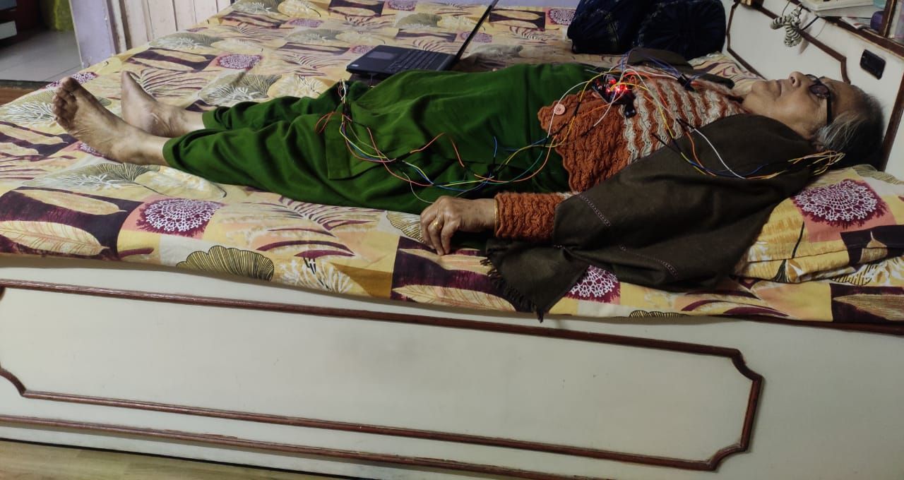

# Posture

Analysis of human posture has many applications in the field of sports and medical science including patient monitoring, lifestyle analysis, elderly care etc. It is important to understand if a person is healthy (in terms of his everyday posture) or is suffering with a joint/bone disease as reflected by his incorrect posture. This project aims to classify the posture during three different activities (standing, sitting and sleeping/lying) as a healthy or unhealthy one. This is done by applying deep learning techniques on a large posture dataset which is collected with the help of MPU-6050 sensors mounted on multiple positions on the body. After the training of the deep learning model is complete, the model can be used for classifying the posture of a person as healthy/unhealthy and notifying the subject about it in real-time. This can be very useful in monitoring day to day health and lifestyle of any person.

# Methodology

For the setup of data collection, three MPU6050 sensors have been interfaced with the Arduino
Uno R3, in order to achieve this, while keeping the setup as simple as possible instead of using
a MUX a software trick has been used, in the Arduino receives data only from x68 address
only, one sensor is given LOW and the other two HIGH and take the data, then the order is
rotated twice to get data from all three sensors. The sensors are then ready to transmit data and
can be used in the posture whose data is to be collected. These sensors are placed on the left side of the chest, right knee and on the back of the subject. The data was collected from six different persons among which three were healthy having good posture and others
were unhealthy persons(suffering from back, foot pain) having bad posture. The sampling time
of the sensor readings was chosen to be 400ms to avoid any redundant values.

These images show the process of data collection during the three different activities:

After collection of data, preprocessing of data and running of deep learning and machine learning classification
algorithms was done on Google Colab which provided GPU as a hardware accelerator.The
GPUs available in Colab often include Nvidia K80s, T4s, P4s and P100s. Python libraries such as numpy, scikit learn and pandas were used for data manipulation. 

Initially, the data had about 37400 samples on which the machine learning classfiers were built. Later the data was extended to about 3 times on which we have used deep learning for classification.

The artificial neural network (ANN) is built using keras framework. The collected data is normalized and then fed to the ANN for training. The data is divided
as 3:1:1 for training, validation and testing.

The dataset (smaller) is uploaded to IEEE Dataport Dataset Upload Competition 
- https://ieee-dataport.org/documents/dataset-iot-assisted-human-posture-recognition
- If you use the data please refer it as "Ritwik,  D.,  Jahnvi,  G.,  Mukesh,  K.,  Nitin,  G.,  Rodrigues,  J.J.:Dataset for iot assisted human posture recognition (2020)."
